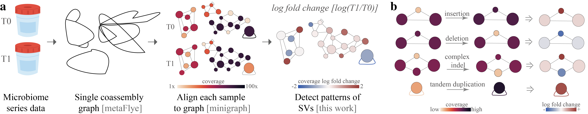

# Rhea: Reference-free Heterogeneity and Evolution in Assembly graphs

### Description

Rhea is a software used to detect structural variants (SVs) between steps in long-read metagenomic series data. Current 
SVs detected include: insertions, deletions, mutations, and tandem duplications. Below is a graphic represtation of the rhea pipeline.

<p align="center">
  
</p>
(a) To utilize rhea, first, microbiome series data is must be collected and long whole genome sequencing reads generated. 
Then, within rhea, a single assembly graph from all reads in the series is created with metaFlye. 
Reads from each sample are then separately aligned to the comprehensive graph with minigraph. 
Rhea evaluates log fold change in coverage between series steps for SV-specific patterns in the assembly graph to 
detect structural variants between steps. 
(b) Assembly graph patterns detected in rhea, which indicate potential insertions, deletions, mutations, and tandem duplicates. 

### Demo

Here is a toy example to detect SV in two different variants E. coli in a metagenome.
First, download t0.fasta and t1.fasta from [OSF](https://osf.io/fvhw8/) under the `example` directory. 
Then run rhea on the samples.

```bash
python ./rhea.py example/t0.fasta example/t1.fasta
```

Expected output: All output files are expected to be in directory `rhea_results`.
Output files include: Bandage_metadata.csv, bp_counts.tsv, edge_coverage-t{0,1}, metaflye directory, node_coverage_norm.csv, 
node_coverage.csv, rhea.log, structual_variants-c0, t{0,1}.gaf.

Expected run time: ~5 minutes for flye

### Installation & Dependencies
Dependencies for rhea include: python v3.8+, [numpy](https://numpy.org/), [pandas](https://pandas.pydata.org/), 
[networkx v3.2+](https://networkx.org/), [seaborn](https://seaborn.pydata.org/), 
[Flye](https://github.com/fenderglass/Flye), and [minigraph](https://github.com/lh3/minigraph).
Environment.yaml can be used build a conda environment with all necessary dependencies; 
rhea environment will need to be activated for each rhea run.

```bash
https://github.com/treangenlab/rhea.git
cd rhea
conda env create -f environment.yml
conda activate rhea
```
We highly recommend using metaFlye v2.9.3+ due to improvements in strain variations maintained.

### Output files
 - `structual_variants-c{1-N}.tsv`: detected structual variants for each pair of subsequent samples. Denoted in the file name.
 - `node_coverage.csv`: Spreadsheet where each row is a unique node. Contains sequence length for each node, 
 detected coverage for each sample, linear change in coverage between subsequent pairs, and log fold change in 
 coverage. Color hex values are also provided for each type of coverage/coverage difference for graph heatmap visuals.
 - `node_coverage_norm.csv`: Same as `node_coverage.csv`, except coverage values are normalized across all samples in the 
   set based on total number of base pairs per sample. Use of normalized or raw values for SV detection
   is determined by the input parameter `--raw-diff` (normalized is default).
 - `edge_coverage-c{}.tsv`: 2D matrix of edge coverage for each provided sample.
 - `Bandage_metadata.csv`: consolidated data for regarding node length, coverage, coverage change, and detected SVs;
  designed to be used with Bandage to create visuals. See below.
 - `bp_counts.tsv`: total number of bps in each sample; used for normalization.
 - `rhea.log`: Computational log and established min/max values for heatmap graph visuals.

### Graph visuals 

Rhea output can be used in conjunction with [Bandage](https://rrwick.github.io/Bandage/) to see patterns SV and evolutionary activity in the metagenome.
1. Install and open [Bandage](https://rrwick.github.io/Bandage/).
2. Load assembly graph: `./rhea_results/metaflye/assembly_graph.gfa`.
3. Select column for node colors from `Bandage_metadata.csv` by changing
 any of the column name ending in `_colour` to `colour`.
4. `Import CSV` for updated CSV into Bandage.
5. Draw graph `single` with `custom colours`.
6. Min/max color scale values can be found in rhea.log. Colored bar can be found in `docs/visual_scales.png`.

### Parameters

| Command	| Default	| Description	|
| :-------  | :----- | :-------- | 
|input | (required)	| paths to input metagenome sequences or alignments|
|--output-dir, -o | rhea_results | path to output directory |
|--type | nano-raw | type of reads for MetaFlye graph construction ['pacbio-raw', 'pacbio-corr', 'pacbio-hifi', 'nano-raw', 'nano-corr', 'nano-hq'] |
|--input-graph | (generated) | path to graph if alignments are provided (req. with alignments)|
|--bp-table | (generated)	| path to bp counts per sample if alignments are provided (req. with alignments)|
|--node-std | 1	| number of standard deviations away from median to call indels and mutations|
|--edge-lfc-thresh | 1	| number of lfc increase to call duplications |
|--raw-diff | FALSE | set to true if no normalization for bp count between samples is desired |
|--collapse | FALSE | activate to collapse metaFlye bubble (i.e. not use --keep-haplotypes) |
|--flye-exec | flye	| path to flye executable |
|--minigraph-exec | minigraph | path to minigraph executable |
|--threads, -t | 3| number of threads utilized by flye & minigraph|


### Citations
If you cite rhea, be sure to also cite [metaFlye](https://www.nature.com/articles/s41592-020-00971-x) and 
[mingraph](https://genomebiology.biomedcentral.com/articles/10.1186/s13059-020-02168-z).
If you use rhea visuals, be sure to cite [Bandage](https://academic.oup.com/bioinformatics/article/31/20/3350/196114).

Rhea publication: TBD

Validation tests & scripts: https://osf.io/fvhw8/

